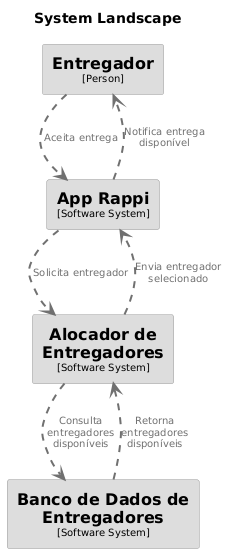

# Business Drivers da Rappi

&emsp;&emsp;Os business drivers são fatores estratégicos que impulsionam o sucesso de uma empresa. No caso da Rappi, foram definidos dois business drivers para otimizar a operação logística e a retenção de entregadores neste trabalho. 

&emsp;&emsp;O primeiro foca em garantir que pelo menos 50% dos entregadores realizem **20 pedidos em até 14 dias**, promovendo engajamento e continuidade na plataforma. O segundo busca reduzir **o tempo de alocação de entregadores**, garantindo que **90% dos pedidos sejam aceitos em até 15 minutos**, melhorando a experiência dos clientes.  

# Tabela de Business Drivers 

| **Business Driver** | **Objetivo** | **Métrica** | **Indicador de Sucesso** | **Impacto** |
|--------------------|-------------|------------|------------------------|------------|
| **Taxa de Retenção nos Primeiros 20 Pedidos** | 50% dos entregadores que aceitaram o primeiro pedido devem completar pelo menos 20 pedidos em até duas semanas. | Taxa de retenção de entregadores. | Se 50% dos entregadores completarem pelo menos 20 pedidos dentro desse período. | Melhorar a retenção de entregadores e garantir uma base ativa na plataforma. |
| **Tempo Máximo para Encontrar um Entregador** | O tempo máximo permitido para encontrar um entregador é de 15 minutos. | Tempo de alocação do entregador. | 90% dos pedidos devem ser alocados dentro de 15 minutos. | Reduzir o tempo de espera dos clientes e melhorar a experiência do usuário. |

# Diagramas Structurizr 

&emsp;&emsp;Os diagramas abaixo representam a estrutura dos sistemas da Rappi para acompanhar os dois business drivers escolhidos:  
1. **Taxa de Retenção nos Primeiros 20 Pedidos**  
2. **Tempo Máximo para Encontrar um Entregador**  

Cada diagrama mostra como os principais componentes se relacionam dentro da plataforma da Rappi.  

---

## 1. Diagrama - Taxa de Retenção nos Primeiros 20 Pedidos  

&emsp;&emsp;O diagrama representa a relação entre os **entregadores**, a plataforma da **Rappi** e o **acompanhamento da taxa de retenção**. Ele mostra como os dados dos entregadores são processados para verificar se **50% dos entregadores completaram pelo menos 20 pedidos em até duas semanas**.

&emsp;&emsp;Segue abaixo o código utilizado para a construção no Structurizr:

```plaintext
workspace "Taxa de Retenção nos Primeiros 20 pedidos" "Mapa do fluxo de retenção de entregadores nos primeiros 20 pedidos." {

    model {
        entregador = person "Entregador"
        appRappi = softwareSystem "App Rappi"
        moduloRetencao = softwareSystem "Módulo de Retenção de Entregadores"
        bancoDados = softwareSystem "Banco de Dados de Entregadores"

        entregador -> appRappi "Realiza entregas"
        appRappi -> moduloRetencao "Registra progresso do entregador"
        moduloRetencao -> bancoDados "Armazena dados de retenção"
        bancoDados -> moduloRetencao "Fornece insights sobre retenção"
        moduloRetencao -> appRappi "Gera incentivos e feedback"
        appRappi -> entregador "Notifica incentivos e feedback"
    }
}
```

&emsp;&emsp;No PlantUML, podemos representar o fluxo de interação entre os elementos como um diagrama de componentes ou diagrama de sequência. Aqui o relacionamento estabelecido é entre o entregador e o App onde podem realizar as entregas e o banco de dados fornecendo as informações de retenção e churn dos entregadores. 

<div align="center">
  <sub>Figura 1: Diagrama Taxa de Retenção</sub>
  
  <sup>Fonte: Anna Aragão (2025)</sup>
</div>

## 2. Diagrama - Tempo Máximo para Alocar 90% dos Entregadores em 15 minutos

&emsp;&emsp;O diagrama representa o fluxo operacional da alocação de entregadores no aplicativo Rappi, garantindo que 90% dos entregadores sejam alocados em até 15 minutos.

&emsp;&emsp;Segue abaixo o código utilizado para a construção no Structurizr:

```plaintext
workspace "Tempo Máximo para Encontrar um Entregador em 15 minutos" "Fluxo de alocação de entregadores no app Rappi." {

    model {
        entregador = person "Entregador"
        appRappi = softwareSystem "App Rappi"
        alocador = softwareSystem "Alocador de Entregadores"
        bancoDados = softwareSystem "Banco de Dados de Entregadores"

        appRappi -> alocador "Solicita entregador"
        alocador -> bancoDados "Consulta entregadores disponíveis"
        bancoDados -> alocador "Retorna entregadores disponíveis"
        alocador -> appRappi "Envia entregador selecionado"
        appRappi -> entregador "Notifica entrega disponível"
        entregador -> appRappi "Aceita entrega"
    }
    
}
```

&emsp;&emsp;No PlantUML, podemos representar o fluxo de interação entre os elementos como um diagrama de componentes ou diagrama de sequência. O relacionamento aqui estabelecido é entre o entregador e o aplicativo, ao qual ele pode aceitar entregas. No entanto, antes da etapa de aceite, há um processo de back-office responsável pela alocação dos entregadores. Esse processo envolve a interação entre o banco de dados, o time de operações (responsável pela alocação) e o aplicativo, que seleciona os entregadores mais adequados para determinada solicitação. Nesse contexto, ocorre a mudança de estado do entregador: de "disponível", quando está em busca de entregas, para "aguardando pedido" ou "a caminho do pedido", caso seja corretamente alocado.

<div align="center">
  <sub>Figura 2: Diagrama Alocação dos Entregadores</sub>
  
  <sup>Fonte: Anna Aragão (2025)</sup>
</div>

# Testes Automatizados

## Estratégia de Testes

&emsp;&emsp;A estratégia de testes para o Mapa de Business Drivers foca na automação de cenários críticos usando Behavior-Driven Development (BDD). A abordagem utiliza a linguagem **Gherkin** para descrever os cenários de teste de forma legível, permitindo uma comunicação eficiente entre desenvolvedores e stakeholders. 

&emsp;&emsp;Os testes são executados com a ferramenta **Behave**, que interpreta os arquivos escritos em Gherkin e os conecta com implementações em **Python**.

## Estrutura dos Testes
&emsp;&emsp;Os testes seguem o padrão **Given-When-Then**, garantindo uma estrutura bem definida para cada cenário:

- **Given**: Define o estado inicial ou pré-condições para a execução do teste.
- **When**: Descreve a ação realizada pelo sistema ou pelo usuário.
- **Then**: Define o resultado esperado após a ação.

## Implementação dos Testes
&emsp;&emsp;Os cenários de teste são escritos em arquivos `.feature` e vinculados a steps implementados em Python. Abaixo temos dois exemplos diferentes de Features seguidas se seus cenários e steps:

```gherkin
Feature: Alocação de Entregadores

  Scenario: Encontrar um entregador dentro do tempo máximo
    Given o sistema inicia a busca por um entregador disponível
    When o sistema encontra um entregador antes de 15 minutos
    Then o sistema deve alocar o entregador para a entrega
```

```gherkin
Feature: Taxa de Retenção nos Primeiros 20 Pedidos

  Scenario: Enviar incentivo apenas quando o entregador atinge 20 pedidos
    Given um entregador cadastrado no sistema
    And o entregador já completou 19 pedidos
    When o entregador realiza mais um pedido com sucesso
    Then o sistema deve registrar o 20º pedido no banco de dados
    And o sistema deve enviar um incentivo para o entregador
    And o entregador deve ser notificado sobre o incentivo no app
```

## Execução dos Testes
&emsp;&emsp;Para rodar os testes automatizados, é utilizado o seguinte comando:

```sh
behave
```

&emsp;&emsp;Isso executará todos os arquivos `.feature` localizados dentro do diretório `features/`. Abaixo temos todos os testes validados e executados com sucesso

<div align="center">
  <sub>Figura 3: Testes Automatizados</sub>
  
  <sup>Fonte: Anna Aragão (2025)</sup>
</div>

# Conclusão

&emsp;&emsp;Além dos benefícios técnicos, a otimização do tempo de alocação dos entregadores gera um impacto social significativo. Reduzir o tempo de espera significa mais entregas em menos tempo, o que aumenta a renda dos entregadores e melhora a experiência dos consumidores. 

&emsp;&emsp;No entanto, essa otimização também pode trazer desafios. Com um ritmo mais acelerado de alocações, os entregadores podem sentir uma maior pressão para cumprir mais pedidos em menos tempo, o que pode afetar seu bem-estar e segurança no trânsito. 

&emsp;&emsp;Portanto, embora os avanços tecnológicos melhorem a eficiência e tragam benefícios claros, é essencial equilibrar essa evolução com políticas que garantam condições de trabalho justas e sustentáveis para os entregadores.